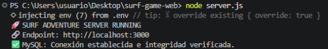
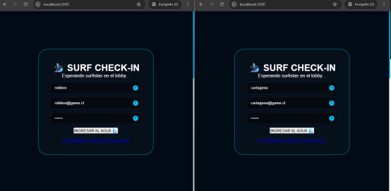
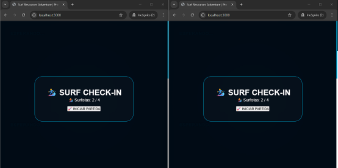
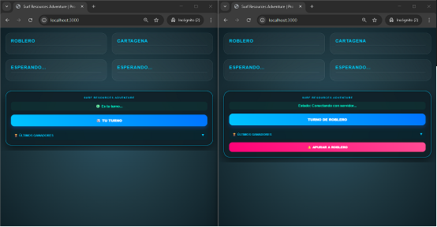
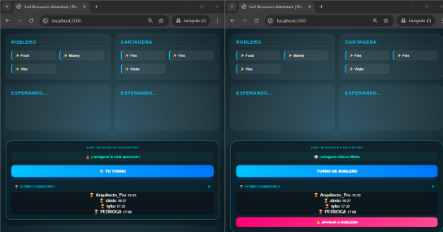

# 🏄‍♂️ Surf Resources Adventure - Pro Edition (2026)

> **Juego multijugador en tiempo real** diseñado con una arquitectura robusta, enfocado en la integridad de datos y la sincronización asíncrona.

---

## 📈 Evolución Arquitectónica (2022 - 2026)
Este sistema representa la **maduración técnica** de una lógica original concebida en 2022:
- **Fase 1 (2022):** Prototipo funcional desarrollado originalmente en **Python (CLI)**.
- **Fase 2 (2026):** Refactorización integral hacia una arquitectura **Full-Stack Robusta** utilizando Node.js, MySQL y comunicación bidireccional con Socket.io. 
*Se priorizó la migración de un motor lineal a una plataforma escalable y persistente.*

---

## 🖼️ Galería del Sistema (Arquitectura Visual)

### 1. Capa de Integridad de Entrada
Validación mediante **Regex** para asegurar datos estructurados y bloqueo de basura en el registro.

### 2. Infraestructura y Backend
Verificación de integridad de base de datos y levantamiento de variables de entorno seguras.

### 3. Sincronización en Tiempo Real (Lobby)
Gestión de quórum para inicio de partida y eventos asíncronos.

### 4. Gameplay e Interacción
Experiencia de usuario y eventos cruzados ("Zumbidos") durante la partida.

### 5. Persistencia E2E (Leaderboard)
Mapeo de datos relacionales en MySQL utilizando la columna `played_at` para el ranking histórico.

---

## 🛡️ Seguridad e Integridad
- **Prevención de SQL Injection:** Consultas preparadas con la librería `mysql2`.
- **Saneamiento E2E:** Validación de tipos y formatos de correo en cliente y servidor.
- **Variables de Entorno:** Gestión de credenciales críticas mediante archivo `.env`.

## 🛠️ Tecnologías Utilizadas
- **Backend:** Node.js & Express.
- **Tiempo Real:** Socket.io.
- **Base de Datos:** MySQL (Relacional).
- **Frontend:** HTML5, CSS3 (Glassmorphism), JS Vanilla.

## 🚀 Instalación
1. `npm install`
2. Configurar `.env` (ver `.env.example`).
3. `node server.js`
